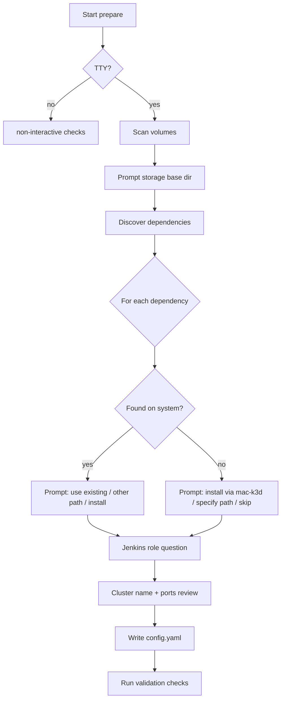

# Interactive Prepare Wizard

`mac-k3d prepare` runs an interactive questionnaire (when stdin is a TTY) to generate `config.yaml`. The wizard covers **where to store heavy data** and **how to handle dependencies**.

For non-interactive/scripted use, see [commands.md](commands.md#prepare).

---

## Invocation

```bash
# Interactive wizard (default on a terminal)
mac-k3d prepare

# Write defaults without prompts (scripting)
mac-k3d prepare --init-config

# Validate only; no prompts, no config changes
mac-k3d prepare --non-interactive
```

---

## Wizard flow



---

## Part 1: Storage and cache locations

Heavy artifacts should live on a volume with enough free space. Small config/state files stay in the home directory.

### What goes where

| Artifact | Typical size | Config key | Default under `storage.base_dir` |
|----------|--------------|------------|-----------------------------------|
| Docker images & layers | 10–100+ GB | `storage.docker` | `docker/` |
| k3d cluster data / image cache | 1–10 GB | `storage.k3d` | `k3d/` |
| Jenkins Helm charts & plugins | 500 MB–2 GB | `storage.jenkins` | `jenkins/` |
| Large downloads (JARs, binaries) | varies | `storage.downloads` | `downloads/` |
| mac-k3d config | KB | `~/.config/mac-k3d/` | *(not relocatable)* |
| Runtime state | KB–MB | `~/.local/state/mac-k3d/` | *(not relocatable)* |

### Volume selection

1. Enumerate mounted volumes (`/`, `/Volumes/*`).
2. Compute available space per volume.
3. **Default**: volume with the most free space.
4. Present top candidates to the user:

```text
Select a base directory for large installs and caches:

  [1] /Volumes/1TB.large/mac-k3d     (recommended, 820 GB free on /Volumes/1TB.large)
  [2] /Users/you/mac-k3d             (45 GB free on /)
  [3] Enter custom path
  [4] Keep current: /Volumes/1TB.large/mac-k3d

Choice [1]:
```

5. Create the directory if missing (after confirmation).
6. Optionally show per-subdir overrides (advanced); most users accept defaults under `base_dir`.

### Docker Desktop data directory

Docker Desktop stores images in its own data location (`~/Library/Containers/com.docker.docker/` by default). Relocating it requires Docker Desktop settings or symlink — the wizard will:

1. Show current Docker disk usage if Docker is installed.
2. Offer to document/suggest moving Docker data to `{base_dir}/docker` (manual step in Docker Desktop → Settings → Resources → Advanced, or symlink guide).
3. Record the **intended** path in config so `start` can warn if usage drifts.

> v1: wizard records preference and prints instructions; automatic Docker data migration is out of scope.

---

## Part 2: Dependencies

For each dependency the wizard discovers what is already installed **before** offering to install anything. **Never uninstall or replace** an existing installation without explicit user consent.

### Dependencies managed

| Name | Required | Discovery |
|------|----------|-----------|
| Docker Desktop | Yes | `/Applications/Docker.app`, `docker info`, `which docker` |
| k3d | Yes | `which k3d`, `brew --prefix k3d` |
| kubectl | Yes | `which kubectl`, `brew --prefix kubectl` |
| helm | If Jenkins enabled | `which helm`, `brew --prefix helm` |
| java | If Jenkins worker agent | `which java`, `/usr/libexec/java_home` |

### Per-dependency prompt (found existing)

```text
Docker Desktop: found
  App:    /Applications/Docker.app
  CLI:    /usr/local/bin/docker  (Docker Desktop 4.x)
  Status: running

  [1] Use this installation (recommended)
  [2] Specify a different path
  [3] Install another copy via mac-k3d (not recommended)

Choice [1]:
```

### Per-dependency prompt (not found)

```text
k3d: not found on PATH

  [1] Install via Homebrew (brew install k3d)
  [2] Specify path to existing binary
  [3] Skip (prepare will fail validation)

Choice [1]:
```

### Install policy

| `dependencies.<name>.source` | Meaning |
|------------------------------|---------|
| `existing` | Use discovered or user-specified path; do not install |
| `install` | mac-k3d runs installer (Homebrew) during prepare or start |
| `skip` | Not required for this machine (e.g. helm on worker without Jenkins) |

Recorded paths are written to config:

```yaml
dependencies:
  docker:
    source: existing
    binary: /usr/local/bin/docker
    app: /Applications/Docker.app
  k3d:
    source: existing
    binary: /opt/homebrew/bin/k3d
  kubectl:
    source: install
    binary: /opt/homebrew/bin/kubectl
  helm:
    source: skip
```

During `start`, mac-k3d prepends configured binary directories to `PATH` for child processes.

---

## Part 3: Role and Jenkins

After storage and dependencies:

```text
What is this Mac's role?

  [1] Local development only (no Jenkins)
  [2] CI controller (install Jenkins in k3d)
  [3] CI worker (Jenkins agent only, no local Jenkins)

Choice [1]:
```

Maps to:

- `jenkins.enabled: true/false`
- Future: `role: controller | worker | standalone`

If controller: confirm `jenkins.host_port` and whether to install helm.

If worker: optionally ask for controller URL (stored for agent setup docs; enrollment remains manual in v1).

---

## Part 4: Cluster settings

Brief confirmation (defaults pre-filled from role):

```text
Cluster name [mac-k3d]:
Number of k3d agent nodes [0]:
HTTP host port [8080]:
Jenkins UI port [9080]:        # only if Jenkins enabled
```

---

## Part 5: Summary and write

```text
Configuration summary:

  Storage base:     /Volumes/1TB.large/mac-k3d
  Docker data:      /Volumes/1TB.large/mac-k3d/docker  (manual move required)
  k3d cache:        /Volumes/1TB.large/mac-k3d/k3d
  Jenkins data:     /Volumes/1TB.large/mac-k3d/jenkins

  Docker Desktop:   existing (/Applications/Docker.app)
  k3d:              existing (/opt/homebrew/bin/k3d)
  kubectl:          install via Homebrew
  helm:             install via Homebrew

  Role:             CI controller
  Cluster:          ci-controller (0 agents)
  Jenkins:          enabled on port 9080

Write to ~/.config/mac-k3d/config.yaml? [Y/n]
```

Then run validation checks and print next steps (`mac-k3d start`).

---

## Non-interactive behavior

`prepare --non-interactive`:

1. Load existing config (or defaults).
2. Verify dependencies per `dependencies.*.source` and paths.
3. Check storage paths exist and are writable.
4. Exit 0 or 1 with actionable errors.

No prompts. Suitable for CI and repeat runs.

---

## Re-running prepare

If `config.yaml` already exists:

```text
Config already exists at ~/.config/mac-k3d/config.yaml

  [1] Re-run wizard (merge / overwrite)
  [2] Validate existing config only
  [3] Cancel

Choice [2]:
```

---

## Implementation notes

| Module | Responsibility |
|--------|----------------|
| `src/prepare/volumes.rs` | List mounts, free space, suggest directories |
| `src/prepare/discovery.rs` | Find docker/k3d/kubectl/helm/java on system |
| `src/prepare/wizard.rs` | Interactive prompts (dialoguer or similar) |
| `src/prepare/install.rs` | Homebrew install wrappers (planned) |

Use `dialoguer` for prompts and `sysinfo` or `libc::statfs` for disk space on macOS.

---

## Related docs

- [configuration.md](configuration.md) — full config schema including `storage` and `dependencies`
- [setup.md](setup.md) — post-prepare setup steps
- [commands.md](commands.md) — CLI flags
